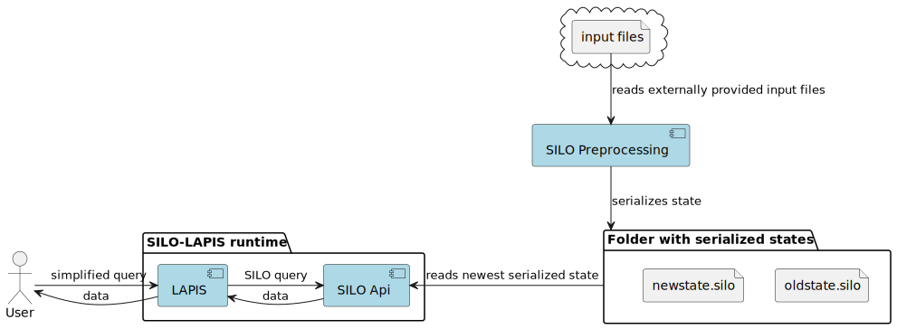

SILO-LAPIS consists of three main components:

- **LAPIS:** A web service wrapping the SILO API.
    - It maps the request to a corresponding SILO query.
- **SILO API:** The query engine exposed as a web service.
    - It accepts **SILO queries** and returns the results. A SILO query specifies
        - a filter expression for which samples should be considered,
        - an action what kind of data should be returned (details, aggregated data, etc.).
    - The SILO API regularly checks for new serialized states of the database (the output of the preprocessing)
      and loads them into memory.
- **SILO Preprocessing:** A command line tool that preprocesses the data for SILO.
  It builds a database from the input data and serializes it to disk.
    - The SILO Preprocessing has to be started by the maintainer of the instance (or e.g. a cronjob).
      It is not a continuously running process.

