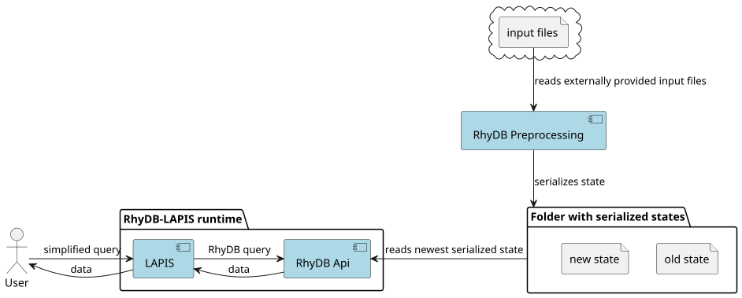

RhyDB-LAPIS consists of three main components:

- **LAPIS:** A web service wrapping the RhyDB API.
    - It maps the request to a corresponding RhyDB query.
- **RhyDB API:** The query engine exposed as a web service.
    - It accepts **RhyDB queries** and returns the results. A RhyDB query specifies
        - a filter expression for which samples should be considered,
        - an action what kind of data should be returned (details, aggregated data, etc.).
    - The RhyDB API regularly checks for new serialized states of the database (the output of the preprocessing)
      and loads them into memory.
- **RhyDB Preprocessing:** A command line tool that preprocesses the data for RhyDB.
  It builds a database from the input data and serializes it to disk.
    - The RhyDB Preprocessing has to be started by the maintainer of the instance (or e.g. a cronjob).
      It is not a continuously running process.

