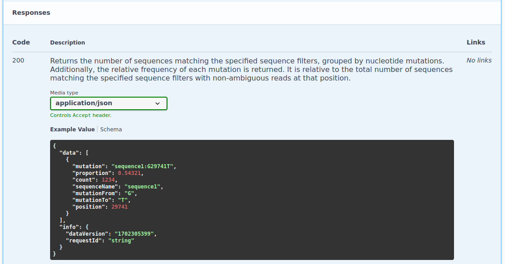
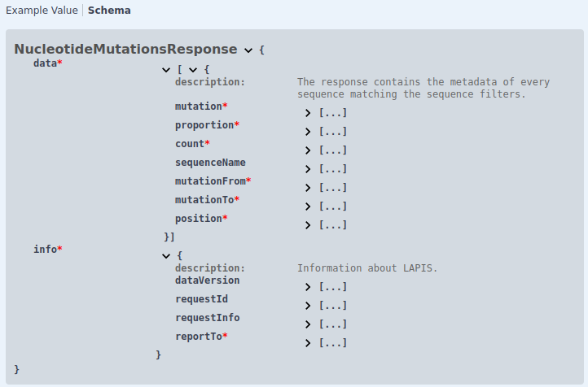

The response format is tailored to each specific endpoint.
To view the response format for a particular endpoint, please visit our [Swagger UI](../references/open-api-definition).
Once there, select the endpoint of interest and scroll down to the "Responses" section.
A '200' response code indicates a successful request, while any other code signifies an error.

Endpoints typically support returning data in JSON, [CSV](https://en.wikipedia.org/wiki/Comma-separated_values) or
[TSV](https://en.wikipedia.org/wiki/Tab-separated_values), with JSON being the default.

:::note
LAPIS returns RFC 4180 compliant TSV and CSV files, which means that cells that contain a new line (or delimiter) are quoted.
This can cause issues when simply splitting at every occurence of a new line character.
We also offer the TSV-ESCAPED data format, where new lines and delimiters are escaped instead of quoted (IANA TSV).
:::

Genomic sequences (such as those from `unalignedNucleotideSequences`, `alignedAminoAcidSequences`, etc.) are provided in the
[FASTA format](https://en.wikipedia.org/wiki/FASTA_format) by default,
but can also be requested in JSON or [NDJSON](https://github.com/ndjson/ndjson-spec) format.

:::note
NDJSON is in particular useful for downloading large datasets, as it allows for streaming data processing.
You can read line by line without loading the entire file into memory.
Since every line is a valid JSON object, it is usually easier to handle programmatically than FASTA.
:::

## Example

To understand the response of the `nucleotideMutation` endpoint, refer to the relevant section in the Swagger UI:

At the top, you'll find a plain text description of the response.
The middle section displays a JSON format response example.
For detailed information about the response data, click on 'Schema'.
This reveals the response structure and descriptions for each field, accessible by clicking the three dots next to them.

Fields marked with an asterisk (\*) are always included in the response; unmarked fields may be omitted.

:::note
Every response, regardless of format, includes the data version as it is crucial information. For more details, visit the
[data versions page](../concepts/data-versions).
:::
