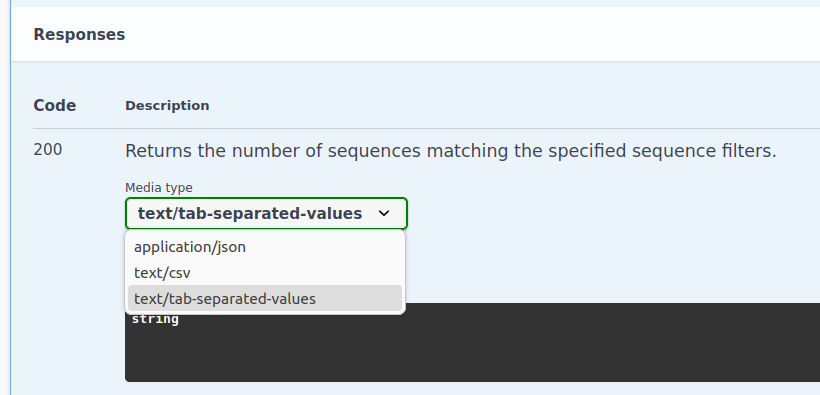

Most of the request properties are sequence filters.
However, there are some properties that influence the response data in other ways.

Check the [Swagger UI](/references/open-api-definition/) for the full specification.

## Ordering The Results

You can specify the response fields by which the results should be ordered.
LAPIS by default sorts in ascending order.

```http
GET /sample/aggregated?orderBy=responseField1,responseField2
```

To specify descending order, you need to send a POST request:

```http
POST /sample/aggregated

{
    "orderBy": [
        "responseField1",
        { "field": "responseField2", "type": "descending" }
    ]
}
```

:::note
You can also specify `random` as the field name to get the results in a random order.
It will act as a tiebreaker if it is provided along with other `orderBy` fields.
:::

:::caution
LAPIS will throw an error if you try to order by a field that is not in the response.
:::

## Pagination

LAPIS supports pagination. You can specify the number of results to return and the offset to start from.

```http
GET /sample/aggregated?limit=10&offset=20
```

Pagination respects the ordering of the results.

## Data Format

By default, LAPIS returns the data in JSON format.
LAPIS also supports returning the data as CSV or TSV.
The format can be specified in the `Accept` header.

```http
GET /sample/aggregated
Accept: text/csv
```

```http
POST /sample/aggregated
Accept: text/tab-separated-values
```



You can specify the parameter `headers=false` in the accept header to exclude the headers from the CSV or TSV response.

```http
GET /sample/aggregated
Accept: text/csv;headers=false
```

:::note
Alternatively, you can use the `dataFormat` property in the request.
Refer to the Swagger UI for allowed values.
:::

## Downloading The Results From A Browser

You can set `downloadAsFile` to `true`.
LAPIS will then set the header `Content-Disposition: attachment; filename=<data.format>`.
This will prompt browsers to download the data as file.

```http
GET /sample/aggregated?downloadAsFile=true
```

## Compression

LAPIS supports gzip and Zstd compression.
You can request compressed data by setting the `compression` property in the request.
Refer to the Swagger UI for allowed values.

```http
GET /sample/aggregated?compression=gzip
```

:::note

Alternatively, you can set the `Accept-Encoding` header.

```http
GET /sample/aggregated
Accept-Encoding: gzip
```

```http
POST /sample/aggregated
Accept-Encoding: zstd
```

LAPIS will set the `Content-Encoding` header in the response to indicate the compression used.

:::caution
If you want to download compressed data via the `downloadAsFile` property,
then you need to specify the compression type via the `compression` property.

LAPIS will ignore the `Accept-Encoding` header, if `downloadAsFile == true`,
since browsers always accept GZIP encoding.
Then, you would not be able to download uncompressed data in a browser.
:::
